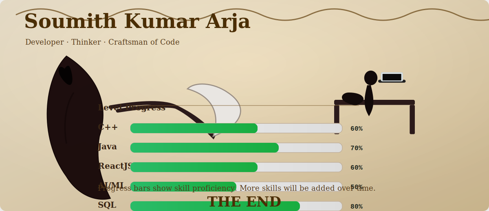

<!-- Header: Retro Pokémon Battle Frame -->
<!-- 🏛 Renaissance Italian Header -->

## 🧑‍🚀 About Me
> _"Turning coffee into code, and bugs into features."_  

🎯 **Mission:** Build impactful and scalable products.  
🛠 **Special Moves:** C++, Java, ReactJS, Python.  
🌱 **Currently Leveling Up:** AngularJS, AI-powered applications, Cloud, REST APIs.  
🏆 **Recent Quest:**  Autonomous Vehicle Navigation System project.  

---

## 📊 GitHub Performance Dashboard

<!-- GitHub Stats -->

&nbsp;
<!-- GitHub Streak -->

  

<!-- Top Languages -->

## 🚀 Current Quests
- 🌐 Expanding skills in **DSA** and **AI/ML**.

---

## 🏆 Achievements Unlocked
- 🎯 Completed **NeuroView - 3D Brain MRI Segmentation Tool** using MeshNet & TensorFlow.js.
- 🚀 Designed **StreamHive - Full-Stack Application** with React, Tailwind, Spring Boot.

---

---

## 📫 How to Reach Me

---

<!-- Footer -->

<!-- 🏛 Renaissance Italian Footer -->

